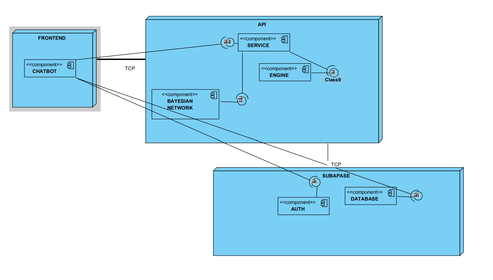

###  Development of a Car Troubleshooting Chatbot Expert System Using Bayesian Networks

### Authors: Alejandro Londoño Bermúdez, Juan Sebastián Díaz Sánchez

### Introduction

Vehicles are an essential part of modern life, and their proper functioning is vital for personal and professional activities. However, diagnosing and troubleshooting car issues can be daunting for many, especially for individuals without technical expertise. Whether it's an unusual noise, difficulty starting the engine, or a persistent check engine light, understanding the root cause of the problem can be time-consuming and costly. For car owners, having access to a reliable tool that can assist in troubleshooting car problems could save both time and money, while also providing peace of mind.

This project seeks to address this challenge by developing an expert system in the form of a chatbot designed to help users diagnose common car issues. By leveraging the power of the Experta library for rule-based reasoning and pgmpy for Bayesian networks, this chatbot will provide users with actionable advice based on symptoms they report. Through a conversational interface, users will be guided through a series of diagnostic steps, helping them pinpoint possible causes and recommend effective solutions.

### General Objective | Problem statement

Develop a medium-complexity expert system using a Python-based chatbot for troubleshooting common car problems, integrating Bayesian networks to enhance decision-making and provide accurate recommendations to users.

### Specific Objectives

- **Identify common car issues to be addressed by the chatbot, including engine performance, electrical systems, and brakes.**

- **Gather domain-specific knowledge from automotive experts and standard troubleshooting guides to build the chatbot’s knowledge base.**

- **Utilize pgmpy to model probabilistic relationships between symptoms, diagnoses, and solutions to enhance the chatbot’s decision-making process.**

- **Conduct usability testing, validate the chatbot’s accuracy, and deploy it on a suitable platform with clear user documentation.**

### Requirements Analysis

#### Functional requirements

* The chatbot shall prompt users to describe symptoms such as: "engine won’t start", "strange noise while braking".

* The chatbot shall support troubleshooting for the following geneal issues:
    * Cooling 
    * Transmission
    * Steering
    * Braking

* The chatbot shall provide simple, step-by-step troubleshooting instructions based on probable causes.

* The chatbot shall explain its reasoning and recommendations in simple terms.

* The chatbot shall indicate to users when an issue is likely to require professional assistance.

#### Non-Functional requirements

* The chatbot shall be easy to navigate, with a conversational and intuitive interface suitable for users with limited technical knowledge.

### Knowledge Acquisition and Representation

Following the Expert System Development Life Cycle (ESDLC), the knowledge acquisition and representation phase involved thorough research and design to ensure a robust and reliable chatbot.

## Scope

The scope of this chatbot project is to provide a user-friendly, conversational tool that assists car owners with basic, symptom-based troubleshooting for common vehicle problems. The chatbot will guide users through diagnostic questions and suggest troubleshooting steps.

### In-Scope Features

* Symptom Based Diagnostics
* Primary Car Systems Covered
* Decision Support

### Out-of-Scope Features

* Complex Mechanical Repairs
* Emergency Services
* Comprehensive Vehicle Servicing

## User target

Everyday car owners and drivers with limited technical knowledge who seek help for unexpected car issues. They may lack confidence in diagnosing car problems themselves and want straightforward, easy to follow advice.

### Needs

* Simplicity and Clarity
* Decision-Making Support
* Safety Guidance

#### Knowledge Acquisition 

1. **Data Collection**  
   The following steps were taken to acquire the necessary knowledge for the Bayesian Network and Expert System:  
   
   - **Conditional Probabilities**: Extensive research was conducted online to gather conditional probabilities in the form of $ P(\text{symptom} | \text{issue}) $. This included consulting automotive repair manuals, online troubleshooting guides, AI, and expert forums.  
   - **Marginal Probabilities**: Marginal probabilities $ P(\text{issue}) $ were obtained from industry reports, vehicle maintenance statistics, and expert consultations to establish prior likelihoods for each car issue.

2. **Data Processing**  
   The collected data was curated and normalized to ensure consistency and reliability in the Bayesian Network. Missing probabilities were estimated using domain knowledge and statistical techniques.

#### Knowledge Representation

1. **Bayesian Network**
   - **Nodes**: Represented both observable symptoms and underlying issues.
   - **Edges**: Captured the probabilistic relationships between symptoms and issues.  
   - **Inference**: The Bayesian Network utilized conditional probability tables (CPTs) to calculate the likelihood of each issue based on reported symptoms.  

2. **Rule-Based System**  
   - The **Experta** library was used to build an expert system on top of the Bayesian Network.  
   - **Rules**: Encoded diagnostic knowledge in the form of "IF-THEN" logic, using the outputs of the Bayesian Network as input facts. 

### System Design

### Implementation Details

#### Backend

The backend implemented a Bayesian Network using the pgmpy library. This network calculated the probability of each type of general car problem (e.g., cooling, transmission, steering, or braking issues) based on the symptoms reported by the user. It modeled probabilistic relationships between symptoms and diagnoses, forming a robust foundation for decision making.

These general problems, identified as facts by the Bayesian network, served as input for an expert system developed using the Experta library. This expert system applied domain-specific rules to provide detailed and actionable recommendations, leveraging the probabilistic context supplied by the Bayesian network.

For user authentication and conversation persistence, Supabase was used, ensuring secure data management and providing users with access to their chatbot interaction history.

#### Frontend

The frontend was a web application built with React and TypeScript, offering a conversational, user-friendly interface. Designed with non-technical users in mind, it provided an intuitive experience, guiding them through a structured question-and-answer flow to identify issues and deliver solutions based on backend logic.

### Testing and Validation 

### **Test Design: `TestIssuesBayesianNetwork`**

#### **1. `test_no_symptoms`**

| **Field**          | **Value**                                                                                                                                                  |
|--------------------|------------------------------------------------------------------------------------------------------------------------------------------------------------|
| **Objective**       | Verify the behavior when an empty list of symptoms is provided.                                                                                             |
| **Description**    | It should validate that when no symptoms are provided, the probabilities for the issues remain at default values and the facts and symptoms lists are empty. |
| **Inputs**         | `symptoms = []`                                                                                                                                             |
| **Expected Behavior** | - The default probabilities:   `Cooling_Issue = 0.5`, `Transmission_Issue = 0.2`, `Steering_Issue = 0.3`, `Braking_Issue = 0.1`  - The lists `facts` and `symptoms` should be empty. |
| **Success Criteria** | - The probabilities must match the default values.  - The `facts` and `symptoms` lists must be empty.                        |

---

#### **2. `test_single_symptom`**

| **Field**          | **Value**                                                                                                                                                  |
|--------------------|------------------------------------------------------------------------------------------------------------------------------------------------------------|
| **Objective**       | Verify the behavior when a single symptom is provided.                                                                                                     |
| **Description**    | It should check that when only one symptom is given, the corresponding issue probability is updated, and the `facts` and `symptoms` lists are updated.|
| **Inputs**         | `symptoms = [1]`  (representing `Symptom_Engine_Overheating`)                                                                                           |
| **Expected Behavior** | - The probability of `Cooling_Issue` should be greater than `0.5`.  - The `facts` list should contain `"Cooling_Issue"`.  - The `symptoms` list should contain `"Symptom_Engine_Overheating"`. |
| **Success Criteria** | - The probability of `Cooling_Issue` should be greater than `0.5`.  - The `facts` and `symptoms` lists should contain the correct values.             |

---

#### **3. `test_multiple_symptoms`**

| **Field**          | **Value**                                                                                                                                                  |
|--------------------|------------------------------------------------------------------------------------------------------------------------------------------------------------|
| **Objective**       | Verify the behavior when multiple symptoms are provided.                                                                                                   |
| **Description**    | This test checks that when multiple symptoms are provided, the probabilities and the `facts` and `symptoms` lists are updated accordingly.                      |
| **Inputs**         | `symptoms = [1, 2, 3]` (representing `Symptom_Engine_Overheating`, `Symptom_Weak_Air_Conditioning`, `Symptom_Fan_Clutch_Failure`)                        |
| **Expected Behavior** | - The probability of `Cooling_Issue` should be greater than `0.5`.  - The `facts` list should contain `"Cooling_Issue"`.  - The `symptoms` list should contain `["Symptom_Engine_Overheating", "Symptom_Weak_Air_Conditioning", "Symptom_Fan_Clutch_Failure"]`. |
| **Success Criteria** | - The probability of `Cooling_Issue` should be greater than `0.5`.  - The `facts` and `symptoms` lists should contain the correct values.             |

---

#### **4. `test_mixed_symptoms`**

| **Field**          | **Value**                                                                                                                                                  |
|--------------------|------------------------------------------------------------------------------------------------------------------------------------------------------------|
| **Objective**       | Verify the behavior when mixed symptoms from different issues are provided.                                                                                   |
| **Description**    | This test checks if multiple issues can be identified when symptoms from different sources are provided.                                          |
| **Inputs**         | `symptoms = [1, 10, 26, 38]` (representing `Symptom_Engine_Overheating`, `Symptom_Irregular_Gear_Shifting`, `Symptom_Stiff_Steering_Wheel`, `Symptom_Worn_Brake_Pads`) |
| **Expected Behavior** | - The probabilities for all issues should be greater than `0.5`.  - The `facts` list should contain `{"Cooling_Issue", "Transmission_Issue", "Steering_Issue", "Braking_Issue"}`.  - The `symptoms` list should contain `{"Symptom_Engine_Overheating", "Symptom_Irregular_Gear_Shifting", "Symptom_Stiff_Steering_Wheel", "Symptom_Worn_Brake_Pads"}`. |
| **Success Criteria** | - The probabilities should be greater than `0.5` for each issue.  - The `facts` and `symptoms` lists should contain the correct values.            |

### Deployment

The system was deployed on AWS

### Conclusion and Future Work
The development of this Car Troubleshooting Chatbot Expert System represents a significant step towards providing accessible, effective, and user-friendly support for everyday car owners and drivers. By integrating a Bayesian Network with rule-based reasoning, we have created a system capable of diagnosing common car issues based on reported symptoms. This system not only provides valuable insights into the possible causes of vehicle problems but also offers actionable recommendations, empowering users to make informed decisions about whether to attempt repairs or seek professional help.

The chatbot's success in guiding users through diagnostic steps with a conversational interface highlights its potential to save time and money by assisting with preliminary troubleshooting, thus reducing the burden of car repairs. Additionally, the backend's use of the pgmpy library to model probabilistic relationships and the Experta library for rule-based reasoning ensures that the system operates with a high degree of accuracy, making it a reliable tool for users without technical knowledge.

However, the project is not without its limitations. The current implementation focuses on common vehicle issues and basic troubleshooting steps. Complex mechanical problems, emergency services, and in-depth vehicle servicing are beyond the scope of this system. In the future, we plan to enhance the system by incorporating more sophisticated diagnostic models, expanding the range of supported issues, and integrating real-time data from vehicle sensors or IoT devices to improve the system's accuracy and efficiency.

Further work will also focus on improving the chatbot's natural language understanding to make the interaction more fluid and intuitive. User feedback and continued testing will help refine the system's conversational flow and ensure that it provides even greater value to users in their everyday car maintenance and troubleshooting tasks.

#### Future Work:
- **Expansion of Troubleshooting Knowledge**: Adding more complex issues and a wider range of symptoms to improve the chatbot's diagnostic capabilities.
- **Integration with IoT Devices**: Incorporating real-time data from connected vehicles to provide more precise and immediate diagnostics.
- **Enhanced Natural Language Processing (NLP)**: Improving the chatbot's ability to understand and process user input in a more conversational and accurate manner.
- **Mobile App Version**: Developing a mobile version of the chatbot to increase accessibility and convenience for users on the go.

### Bibliographic references

Heckerman, D. (1995). Probabilistic Similarity Networks. MIT Press.

Jackson, P. (1999). Introduction to Expert Systems (3rd ed.). Addison-Wesley.